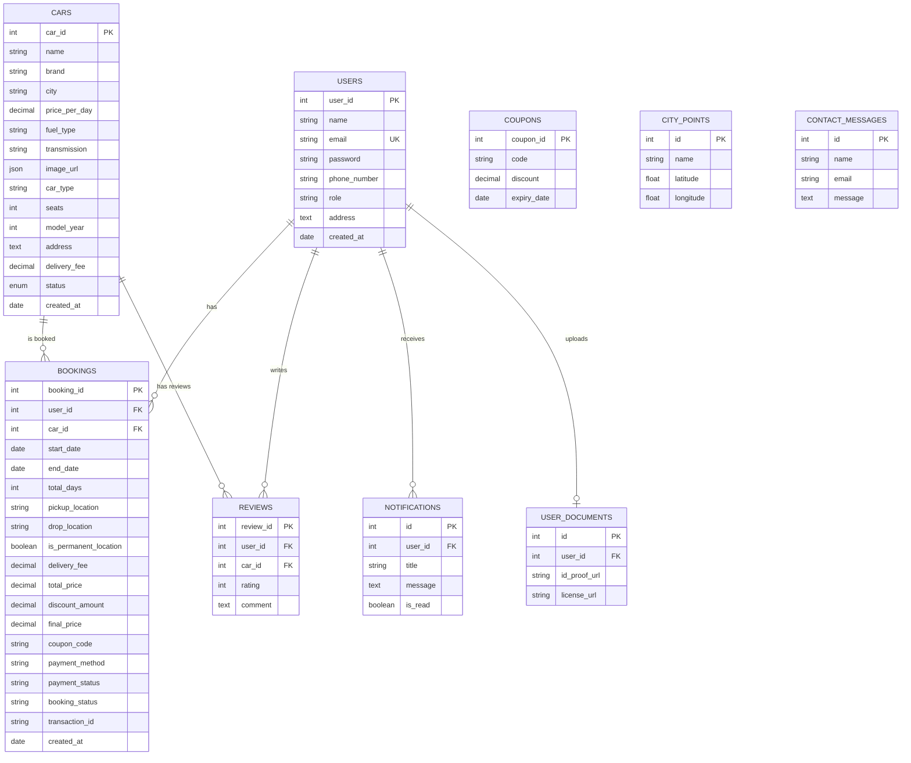

# 🚗 Rentify — Premium Car Rental Platform

<div align="center">


**A modern, full-stack car rental web application with a rich customer experience and a powerful admin dashboard.**

[Features](#-features) · [Tech Stack](#-tech-stack) · [Getting Started](#-getting-started) · [Project Structure](#-project-structure) · [API Reference](#-api-reference) · [Screenshots](#-screenshots)

</div>

---

## 📋 Overview

Rentify is a full-featured car rental platform that allows customers to browse, book, and manage car rentals seamlessly. It includes a comprehensive admin panel for fleet management, booking oversight, analytics, coupon management, and more. The application is built with a **React (Vite)** frontend and a **Node.js / Express** REST API backend, backed by **PostgreSQL** via Sequelize ORM.

---

## ✨ Features

### 🧑‍💼 Customer Features

| Feature | Description |
|---|---|
| **Browse & Search Cars** | View available cars with filters for brand, fuel type, transmission, and more |
| **Car Details** | Detailed car pages with image galleries, specs, and reviews |
| **Online Booking** | Select dates, pickup/drop locations, apply coupons, and book instantly |
| **My Bookings** | Track booking history with status updates (Pending → Confirmed → Completed) |
| **Invoice Generation** | View and download detailed invoices for each booking |
| **User Profile** | Manage personal info, change password, and upload verification documents (ID & License) |
| **OTP Verification** | Email-based OTP for secure registration |
| **Reviews & Ratings** | Leave reviews for rented cars |
| **Contact Support** | Send messages to the admin team via the contact form |
| **Interactive Map** | Leaflet-powered map showing pickup/drop city points |

### 🛡️ Admin Features

| Feature | Description |
|---|---|
| **Dashboard** | At-a-glance metrics — total cars, bookings, customers, and revenue |
| **Fleet Management** | Add, edit, activate/deactivate cars with multi-image upload via Cloudinary |
| **Rent Requests** | Approve, confirm, or cancel incoming booking requests |
| **Customer Management** | View registered users, their documents, and booking history |
| **Payments Overview** | Monitor payment statuses and transaction details |
| **Coupon Management** | Create, edit, and delete promotional coupons |
| **Messages Inbox** | Read and respond to customer contact messages |
| **Reviews Moderation** | View all submitted car reviews |
| **Analytics** | Visual analytics and insights on platform performance |
| **Document Verification** | Review uploaded user ID and license documents |
| **City Points** | Manage pickup/drop-off location points on the map |

---

## 🛠️ Tech Stack

### Frontend

| Technology | Purpose |
|---|---|
| **React 19** | UI library |
| **Vite 8** | Build tool & dev server |
| **React Router 7** | Client-side routing & protected routes |
| **Axios** | HTTP client with JWT interceptor |
| **Framer Motion** | Animations & transitions |
| **Bootstrap 5** | Responsive layout & UI components |
| **Leaflet / React-Leaflet** | Interactive maps |
| **Lucide React** | Icon library |
| **Tailwind CSS (Forms & Typography)** | Utility plugins |
| **Poppins (Google Fonts)** | Typography |

### Backend

| Technology | Purpose |
|---|---|
| **Node.js + Express 5** | REST API server |
| **Sequelize 6** | PostgreSQL ORM |
| **PostgreSQL** | Relational database |
| **JSON Web Tokens (JWT)** | Authentication & authorization |
| **bcryptjs** | Password hashing |
| **Cloudinary** | Image & document storage |
| **Multer** | File upload handling |
| **Nodemailer** | Email (OTP & notifications) |
| **dotenv** | Environment configuration |
| **CORS** | Cross-origin resource sharing |

---

## 🚀 Getting Started

### Prerequisites

- **Node.js** ≥ 18.x
- **npm** ≥ 9.x
- **PostgreSQL** ≥ 14.x
- **Cloudinary** account (for media uploads)
- **SMTP email** credentials (for OTP / notifications)

### 1. Clone the Repository

```bash
git clone https://github.com/HardipZapadiya/Rentify.git
cd Rentify
```

### 2. Backend Setup

```bash
cd backend
npm install
```

Create a `.env` file in the `backend/` directory:

```env
# Server
PORT=5000
NODE_ENV=development

# Database (PostgreSQL)
DB_NAME=rentify
DB_USER=postgres
DB_PASSWORD=your_db_password
DB_HOST=localhost
DB_PORT=5432

# JWT
JWT_SECRET=your_jwt_secret_key

# Cloudinary
CLOUDINARY_CLOUD_NAME=your_cloud_name
CLOUDINARY_API_KEY=your_api_key
CLOUDINARY_API_SECRET=your_api_secret

# Email (SMTP)
EMAIL_HOST=smtp.gmail.com
EMAIL_PORT=587
EMAIL_USER=your_email@gmail.com
EMAIL_PASS=your_app_password
```

Create and seed the database:

```bash
# Create the database (ensure PostgreSQL is running)
node create_db.js

# Sync models to the database
node sync_models.js

# Seed an admin user
node seed_admin.js

# (Optional) Seed sample cars
node seed_cars.js
```

Start the backend server:

```bash
node app.js
```

> The API will be running at `http://localhost:5000`

### 3. Frontend Setup

```bash
cd ../frontend
npm install
```

Start the development server:

```bash
npm run dev
```

> The app will be running at `http://localhost:5173`

### 4. Build for Production

```bash
cd frontend
npm run build
npm run preview
```

---

## 📁 Project Structure

```
Rentify/
├── backend/
│   ├── config/
│   │   └── db.js                  # PostgreSQL + Sequelize connection
│   ├── controllers/
│   │   ├── AdminController.js     # Admin CRUD operations
│   │   ├── AuthController.js      # Login & registration
│   │   ├── BookingController.js   # Booking lifecycle management
│   │   ├── CarController.js       # Car listing & details
│   │   ├── CityPointController.js # Map pickup/drop points
│   │   ├── ContactController.js   # Contact form messages
│   │   ├── DocumentController.js  # User document uploads
│   │   └── ReviewController.js    # Car reviews
│   ├── middlewares/
│   │   └── auth.js                # JWT protect & admin guard
│   ├── models/
│   │   ├── Booking.js             # Booking schema
│   │   ├── Car.js                 # Car schema
│   │   ├── CityPoint.js           # Pickup/drop location schema
│   │   ├── ContactMessage.js      # Contact message schema
│   │   ├── Coupon.js              # Coupon/discount schema
│   │   ├── Notification.js        # Notification schema
│   │   ├── Review.js              # Review schema
│   │   ├── User.js                # User schema (with bcrypt hooks)
│   │   ├── UserDocument.js        # Document verification schema
│   │   └── index.js               # Model associations
│   ├── routes/
│   │   ├── adminRoutes.js         # /api/admin/*
│   │   ├── authRoutes.js          # /api/auth/*
│   │   ├── bookingRoutes.js       # /api/bookings/*
│   │   ├── carRoutes.js           # /api/cars/*
│   │   ├── cityPointRoutes.js     # /api/citypoints/*
│   │   ├── contactRoutes.js       # /api/contact/*
│   │   ├── documentRoutes.js      # /api/documents/*
│   │   └── otpRoutes.js           # /api/otp/*
│   ├── utils/
│   │   ├── cloudinary.js          # Cloudinary config
│   │   └── sendEmail.js           # Email transporter
│   ├── app.js                     # Express app entry point
│   ├── create_db.js               # Database creation script
│   ├── seed_admin.js              # Admin seeder
│   ├── seed_cars.js               # Sample car seeder
│   └── sync_models.js             # Model sync utility
│
├── frontend/
│   ├── public/
│   │   └── assets/                # Bootstrap CSS/JS, custom styles
│   ├── src/
│   │   ├── components/
│   │   │   ├── auth/
│   │   │   │   └── ProtectedRoute.jsx   # Route guards
│   │   │   ├── cars/
│   │   │   │   └── CarCard.jsx          # Car listing card
│   │   │   └── layout/
│   │   │       ├── AdminLayout.jsx      # Admin sidebar layout
│   │   │       ├── Footer.jsx           # Site footer
│   │   │       └── Navbar.jsx           # Navigation bar
│   │   ├── context/
│   │   │   └── AuthContext.jsx    # Auth state management
│   │   ├── pages/
│   │   │   ├── HomePage.jsx       # Landing page
│   │   │   ├── CarsPage.jsx       # Car listing with filters
│   │   │   ├── CarDetailsPage.jsx # Individual car view
│   │   │   ├── BookingPage.jsx    # Booking flow & checkout
│   │   │   ├── MyBookingsPage.jsx # Customer booking history
│   │   │   ├── InvoicePage.jsx    # Booking invoice
│   │   │   ├── ProfilePage.jsx    # User profile & docs
│   │   │   ├── LoginPage.jsx      # Login form
│   │   │   ├── RegisterPage.jsx   # Registration with OTP
│   │   │   ├── AboutPage.jsx      # About us
│   │   │   ├── ContactPage.jsx    # Contact form
│   │   │   ├── AdminDashboard.jsx         # Admin overview
│   │   │   ├── AdminCarsPage.jsx          # Fleet management
│   │   │   ├── AdminCustomersPage.jsx     # User management
│   │   │   ├── AdminRentRequestPage.jsx   # Booking approvals
│   │   │   ├── AdminPaymentsPage.jsx      # Payment tracking
│   │   │   ├── AdminCouponsPage.jsx       # Coupon CRUD
│   │   │   ├── AdminMessagesPage.jsx      # Message inbox
│   │   │   ├── AdminReviewsPage.jsx       # Review moderation
│   │   │   ├── AdminAnalyticsPage.jsx     # Analytics dashboard
│   │   │   ├── AdminDocumentsPage.jsx     # Document review
│   │   │   ├── AdminCityPointsPage.jsx    # Map point management
│   │   │   └── AdminProfilePage.jsx       # Admin profile
│   │   ├── services/
│   │   │   └── api.js             # Axios instance with interceptor
│   │   ├── utils/
│   │   │   └── validators.js      # Client-side form validators
│   │   ├── App.jsx                # Root component & routing
│   │   └── main.jsx               # React DOM entry
│   ├── index.html                 # HTML template
│   ├── vite.config.js             # Vite configuration
│   └── package.json
│
└── README.md
```

---

## 🔌 API Reference

All endpoints are prefixed with `/api`.

### Authentication (`/api/auth`)

| Method | Endpoint | Description | Auth |
|--------|----------|-------------|------|
| `POST` | `/register` | Register a new user | ❌ |
| `POST` | `/login` | Login & receive JWT | ❌ |

### OTP (`/api/otp`)

| Method | Endpoint | Description | Auth |
|--------|----------|-------------|------|
| `POST` | `/send` | Send OTP to email | ❌ |
| `POST` | `/verify` | Verify OTP code | ❌ |

### Cars (`/api/cars`)

| Method | Endpoint | Description | Auth |
|--------|----------|-------------|------|
| `GET` | `/` | List all active cars | ❌ |
| `GET` | `/:id` | Get car details | ❌ |

### Bookings (`/api/bookings`)

| Method | Endpoint | Description | Auth |
|--------|----------|-------------|------|
| `POST` | `/` | Create a new booking | 🔒 |
| `GET` | `/my` | Get user's bookings | 🔒 |
| `GET` | `/:id` | Get booking details | 🔒 |

### Contact (`/api/contact`)

| Method | Endpoint | Description | Auth |
|--------|----------|-------------|------|
| `POST` | `/` | Submit a contact message | ❌ |

### Documents (`/api/documents`)

| Method | Endpoint | Description | Auth |
|--------|----------|-------------|------|
| `POST` | `/upload` | Upload ID / license docs | 🔒 |
| `GET` | `/` | Get user's documents | 🔒 |

### City Points (`/api/citypoints`)

| Method | Endpoint | Description | Auth |
|--------|----------|-------------|------|
| `GET` | `/` | List all city points | ❌ |
| `POST` | `/` | Create a city point | 🔒 Admin |
| `DELETE` | `/:id` | Delete a city point | 🔒 Admin |

### Admin (`/api/admin`)

| Method | Endpoint | Description | Auth |
|--------|----------|-------------|------|
| `GET` | `/dashboard` | Dashboard statistics | 🔒 Admin |
| `GET` | `/customers` | List all customers | 🔒 Admin |
| `GET` | `/bookings` | List all bookings | 🔒 Admin |
| `PUT` | `/bookings/:id` | Update booking status | 🔒 Admin |
| `POST` | `/cars` | Add a new car | 🔒 Admin |
| `PUT` | `/cars/:id` | Update car details | 🔒 Admin |
| `DELETE` | `/cars/:id` | Delete a car | 🔒 Admin |

> 🔒 = Requires JWT token &nbsp;&nbsp; 🔒 Admin = Requires JWT + Admin role

---

## 🗃️ Database Schema



---

## 🔐 Authentication Flow

1. **Registration** — User submits details → OTP sent via email → OTP verified → Account created → JWT issued
2. **Login** — Email + password validated → JWT token returned → Stored in `localStorage`
3. **Protected Routes** — Axios interceptor attaches `Authorization: Bearer <token>` to every request
4. **Route Guards** — `ProtectedRoute` component checks auth state; `adminOnly` prop restricts admin pages

---

## 🌐 Environment Variables

| Variable | Description | Required |
|----------|-------------|----------|
| `PORT` | Backend server port (default: `5000`) | ✅ |
| `NODE_ENV` | `development` or `production` | ✅ |
| `DB_NAME` | PostgreSQL database name | ✅ |
| `DB_USER` | PostgreSQL username | ✅ |
| `DB_PASSWORD` | PostgreSQL password | ✅ |
| `DB_HOST` | Database host (default: `localhost`) | ✅ |
| `DB_PORT` | Database port (default: `5432`) | ✅ |
| `JWT_SECRET` | Secret key for JWT signing | ✅ |
| `CLOUDINARY_CLOUD_NAME` | Cloudinary cloud name | ✅ |
| `CLOUDINARY_API_KEY` | Cloudinary API key | ✅ |
| `CLOUDINARY_API_SECRET` | Cloudinary API secret | ✅ |
| `EMAIL_HOST` | SMTP host | ✅ |
| `EMAIL_PORT` | SMTP port | ✅ |
| `EMAIL_USER` | SMTP email address | ✅ |
| `EMAIL_PASS` | SMTP email password / app password | ✅ |

---

## 📜 Available Scripts

### Backend

| Command | Description |
|---------|-------------|
| `node app.js` | Start the Express server |
| `node create_db.js` | Create the PostgreSQL database |
| `node sync_models.js` | Sync Sequelize models to the DB |
| `node seed_admin.js` | Seed an admin user |
| `node seed_cars.js` | Seed sample car data |
| `node test_cloudinary.js` | Test Cloudinary connection |
| `node test_email.js` | Test email configuration |

### Frontend

| Command | Description |
|---------|-------------|
| `npm run dev` | Start Vite dev server |
| `npm run build` | Build for production |
| `npm run preview` | Preview production build |
| `npm run lint` | Run ESLint |

---

## 🤝 Contributing

1. Fork the repository
2. Create a feature branch (`git checkout -b feature/amazing-feature`)
3. Commit your changes (`git commit -m 'Add amazing feature'`)
4. Push to the branch (`git push origin feature/amazing-feature`)
5. Open a Pull Request

---

## 📄 License

This project is licensed under the **ISC License**.

---

<div align="center">

Made with ❤️ by the Rentify Team

</div>
